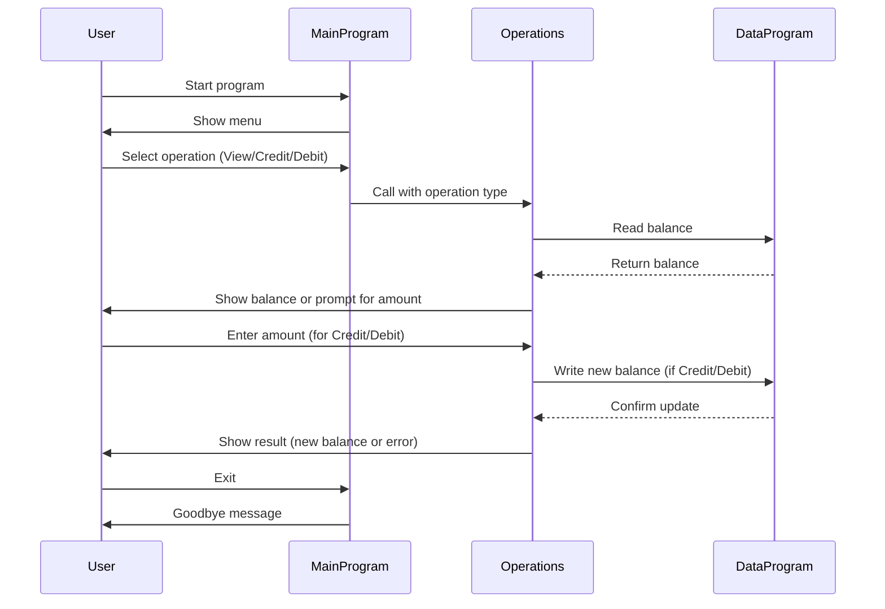

# COBOL Source Documentation

This project contains COBOL source files for a simple student account management system. Below is a summary of each file, its key functions, and business rules related to student accounts.

## File Overview

### `main.cob`
**Purpose:**
- Entry point for the Account Management System.
- Presents a menu to the user for account operations: View Balance, Credit Account, Debit Account, and Exit.
- Handles user input and delegates operations to `operations.cob`.

**Key Functions:**
- Displays menu and accepts user choices.
- Calls the `Operations` program with the selected operation type.

**Business Rules:**
- Only allows valid choices (1-4).
- Exits the program gracefully when the user selects Exit.

---

### `operations.cob`
**Purpose:**
- Implements the logic for account operations: viewing balance, crediting, and debiting.
- Interacts with `data.cob` to read and update the account balance.

**Key Functions:**
- Handles three operations: `TOTAL` (view balance), `CREDIT` (add funds), and `DEBIT` (subtract funds).
- Prompts user for amounts when crediting or debiting.
- Validates sufficient funds before debiting.
- Updates balance using the `DataProgram`.

**Business Rules:**
- Initial balance is set to 1000.00.
- Debit operation checks for sufficient funds before proceeding.
- Credit and debit operations update the stored balance.

---

### `data.cob`
**Purpose:**
- Manages persistent storage of the account balance.
- Provides read and write operations for the balance.

**Key Functions:**
- `READ`: Returns the current stored balance.
- `WRITE`: Updates the stored balance with a new value.

**Business Rules:**
- Initial balance is set to 1000.00.
- Only two operations are supported: `READ` and `WRITE`.

---

## Student Account Business Rules
- Each student account starts with a balance of 1000.00.
- Students can view their balance, credit (add) funds, or debit (subtract) funds.
- Debit operations are only allowed if sufficient funds are available.
- All changes to the balance are persisted via the `data.cob` logic.

---

## Sequence Diagram: Student Account Management System

